# Oryx — Compliance OCR Data Extractor
## Software Architecture Document
**Version:** 1.0  
**Date:** 2026-04-14  
**Author:** Architecture Review (Claude Sonnet 4.6)  
**Classification:** Internal

---

## Table of Contents

1. [Executive Summary](#1-executive-summary)
2. [System Context (C4 Level 1)](#2-system-context-c4-level-1)
3. [Container Architecture (C4 Level 2)](#3-container-architecture-c4-level-2)
4. [Component Architecture (C4 Level 3)](#4-component-architecture-c4-level-3)
5. [Data Model](#5-data-model)
6. [Request Lifecycle](#6-request-lifecycle)
7. [OCR Processing Pipeline](#7-ocr-processing-pipeline)
8. [Authentication & Authorization](#8-authentication--authorization)
9. [Async Task Architecture](#9-async-task-architecture)
10. [Security Architecture](#10-security-architecture)
11. [Deployment Architecture](#11-deployment-architecture)
12. [Key Design Decisions & Trade-offs](#12-key-design-decisions--trade-offs)
13. [Architectural Risks & Recommendations](#13-architectural-risks--recommendations)

---

## 1. Executive Summary

**Oryx** is a Django 5 monolithic web application designed to automate compliance document processing at NSSF Uganda. It ingests scanned documents (PDF, PNG, TIFF, JPEG, BMP, WEBP), routes them through a pre-processing + Azure AI OCR pipeline, surfaces low-confidence extractions for human review, and exports structured results to Excel and Word.

### Core Capabilities

| Capability | Implementation |
|---|---|
| Document ingestion | Multi-file upload, batch grouping, 50 MB per-file limit |
| OCR processing | Azure Document Intelligence (4 prebuilt models) |
| Confidence-aware review | ReviewFlag model with human correction workflow |
| Role-based access control | 3-tier RBAC (Admin / Supervisor / Operator) scoped to Department |
| SSO | SAML 2.0 via Azure AD (djangosaml2) |
| Async processing | Celery + Redis task queue |
| Encrypted storage | AES-256-GCM at rest, Nginx TLS in transit |
| Audit trail | Append-only AuditLog with IP, user, action, duration |
| Exports | XLSX (pandas / openpyxl), DOCX (python-docx) |

### Technology Stack Summary

```
Language .............. Python 3.12
Web framework ......... Django 5.0
Database .............. PostgreSQL 16
Task queue ............ Celery 5 + Redis 7
OCR service ........... Azure Document Intelligence
Web server ............ Gunicorn (3 workers) behind Nginx
Auth .................. SAML 2.0 (djangosaml2) + local fallback
Containerisation ...... Docker + Docker Compose
Package manager ....... uv (Rust-based, replaces pip)
```

---

## 2. System Context (C4 Level 1)

This diagram shows Oryx in relation to the users and external systems it interacts with.

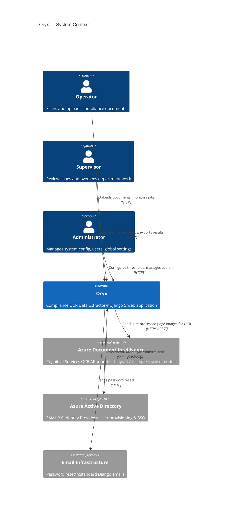

### External Dependency Summary

| System | Purpose | Coupling | Risk |
|---|---|---|---|
| Azure Document Intelligence | Core OCR engine | Hard | High — no offline fallback |
| Azure Active Directory | Identity provider (SAML) | Soft (local login fallback) | Medium |
| PostgreSQL | Persistent state store | Hard | Low (standard, self-hosted) |
| Redis | Celery broker + result backend | Hard | Low (self-hosted) |

---

## 3. Container Architecture (C4 Level 2)

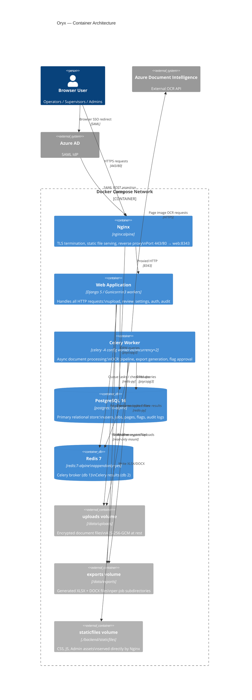

### Container Responsibilities

| Container | Start Command | Key Env Vars |
|---|---|---|
| nginx | `nginx -g 'daemon off;'` | — (config via nginx.conf) |
| web | `gunicorn config.wsgi --workers 3 --timeout 300` | `SECRET_KEY`, `POSTGRES_*`, `SAML_*` |
| worker | `celery -A config worker --concurrency 2 --max-tasks-per-child 50` | `CELERY_BROKER_URL`, `AZURE_ENDPOINT`, `AZURE_KEY` |
| postgres | default entrypoint | `POSTGRES_DB`, `POSTGRES_USER`, `POSTGRES_PASSWORD` |
| redis | `redis-server --appendonly yes` | — |

---

## 4. Component Architecture (C4 Level 3)

### 4.1 Django Application Layers

```
┌─────────────────────────────────────────────────────────────────────┐
│                          PRESENTATION LAYER                         │
│   Django Templates (Jinja-compatible)                               │
│   ┌────────────┐ ┌──────────────┐ ┌──────────────┐ ┌───────────┐  │
│   │ login.html │ │ detail.html  │ │ review.html  │ │ list.html │  │
│   │ (auth)     │ │ (job detail) │ │ (flag review)│ │ (workspace│  │
│   └────────────┘ └──────────────┘ └──────────────┘ └───────────┘  │
│   ┌─────────────────────┐ ┌───────────────────────────────────────┐│
│   │ settings_page/index │ │ includes/ (partials: badges, cards)   ││
│   └─────────────────────┘ └───────────────────────────────────────┘│
└─────────────────────────────────────────────────────────────────────┘
                                  │
┌─────────────────────────────────────────────────────────────────────┐
│                           REQUEST LAYER                             │
│   Middleware Pipeline                                               │
│   SecurityMiddleware → SessionMiddleware → CsrfViewMiddleware       │
│   → AuthenticationMiddleware → SessionIdleTimeoutMiddleware*        │
│   → MessageMiddleware → XFrameOptionsMiddleware                     │
│   * Custom: enforces 5-min idle timeout, logs out on expiry         │
└─────────────────────────────────────────────────────────────────────┘
                                  │
┌─────────────────────────────────────────────────────────────────────┐
│                           ROUTING LAYER                             │
│   config/urls.py                                                    │
│   ┌────────────────────┐   ┌────────────────────────────────────┐  │
│   │ /auth/*            │   │ /workspace/*  /settings/*          │  │
│   │ accounts.views     │   │ /control/*                         │  │
│   │                    │   │ documents.views                    │  │
│   └────────────────────┘   └────────────────────────────────────┘  │
│   ┌────────────────────┐   ┌────────────────────────────────────┐  │
│   │ /sso/* (conditional│   │ /health/   /django-admin/          │  │
│   │ djangosaml2.urls)  │   │                                    │  │
│   └────────────────────┘   └────────────────────────────────────┘  │
└─────────────────────────────────────────────────────────────────────┘
                                  │
┌─────────────────────────────────────────────────────────────────────┐
│                           APPLICATION LAYER                         │
│                                                                     │
│   accounts/                        documents/                       │
│   ┌──────────────────────────┐    ┌──────────────────────────────┐ │
│   │ views.py                 │    │ views.py                     │ │
│   │  OryxLoginView           │    │  upload_view                 │ │
│   │  OryxLogoutView          │    │  document_detail_view        │ │
│   │  session_activity_view   │    │  review_view                 │ │
│   │  session_status_view     │    │  approve_flags_view          │ │
│   └──────────────────────────┘    │  stop_job_view               │ │
│   ┌──────────────────────────┐    │  restart_job_view            │ │
│   │ access.py                │    │  export_download_view        │ │
│   │  RBAC helper functions   │◄───│  audit_log_view              │ │
│   │  visible_*_queryset()    │    │  admin_stats_view            │ │
│   │  can_*() predicates      │    │  settings_view               │ │
│   └──────────────────────────┘    └──────────────────────────────┘ │
│   ┌──────────────────────────┐    ┌──────────────────────────────┐ │
│   │ auth_backends.py         │    │ job_control.py               │ │
│   │  OryxSaml2Backend        │    │  queue_processing_job()      │ │
│   │  assertion replay cache  │    │  clear_job_artifacts()       │ │
│   │  dept sync               │    │  revoke_processing_task()    │ │
│   └──────────────────────────┘    │  mark_job_stopped()          │ │
│   ┌──────────────────────────┐    └──────────────────────────────┘ │
│   │ saml.py                  │    ┌──────────────────────────────┐ │
│   │  populate_azure_oid()    │    │ reviewing.py                 │ │
│   │  role/dept mapping       │    │  approve_review_flags()      │ │
│   └──────────────────────────┘    └──────────────────────────────┘ │
│                                   ┌──────────────────────────────┐ │
│                                   │ exporting.py                 │ │
│                                   │  build_job_exports()         │ │
│                                   └──────────────────────────────┘ │
│                                   ┌──────────────────────────────┐ │
│                                   │ storage.py                   │ │
│                                   │  EncryptedFileSystemStorage  │ │
│                                   │  AES-256-GCM read/write      │ │
│                                   └──────────────────────────────┘ │
└─────────────────────────────────────────────────────────────────────┘
                                  │
┌─────────────────────────────────────────────────────────────────────┐
│                             DATA LAYER                              │
│   accounts/models.py              documents/models.py               │
│   ┌──────────────┐               ┌──────────────────────────────┐  │
│   │ User         │               │ Job  BatchUpload  PageResult │  │
│   │ Department   │               │ ReviewFlag  SystemConfig     │  │
│   └──────────────┘               │ AuditLog                    │  │
│                                  └──────────────────────────────┘  │
│                                                                     │
│   PostgreSQL 16 via psycopg3 (Django ORM)                          │
└─────────────────────────────────────────────────────────────────────┘
                                  │
┌─────────────────────────────────────────────────────────────────────┐
│                        PROCESSING LAYER (no Django deps)            │
│   processing/                                                       │
│   ┌──────────────┐ ┌───────────────┐ ┌────────────┐ ┌──────────┐  │
│   │preprocess.py │ │azure_client.py│ │extractors  │ │exporters │  │
│   │- grayscale   │ │- doc-intel    │ │.py         │ │.py       │  │
│   │- denoise     │ │  client cache │ │- registry  │ │- xlsx    │  │
│   │- CLAHE       │ │- 4 OCR models │ │  pattern   │ │- docx    │  │
│   │- deskew      │ │- confidence   │ │- regex     │  └──────────┘  │
│   │- auto-crop   │ │  scoring      │ │  extraction│               │
│   └──────────────┘ └───────────────┘ └────────────┘               │
└─────────────────────────────────────────────────────────────────────┘
```

### 4.2 Async Task Components

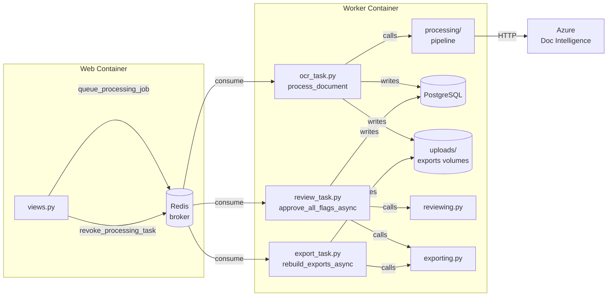

---

## 5. Data Model

### 5.1 Entity Relationship Diagram

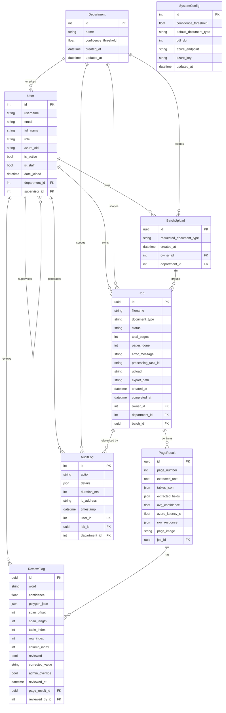

### 5.2 Job Status State Machine

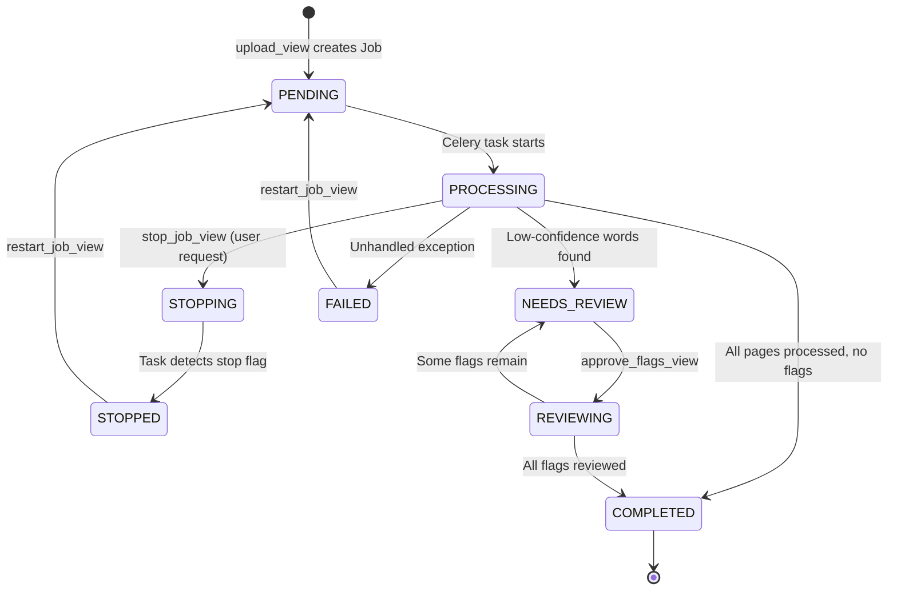

### 5.3 Document Type → OCR Model Mapping

| Document Type | Azure Model | Use Case |
|---|---|---|
| `generic` | `prebuilt-layout` | General documents, forms |
| `receipt` | `prebuilt-receipt` | Purchase receipts |
| `invoice` | `prebuilt-invoice` | Vendor invoices |
| `bank_statement` | `prebuilt-layout` | Bank statements |
| `payroll` | `prebuilt-layout` | Payroll documents |

---

## 6. Request Lifecycle

### 6.1 Document Upload Flow

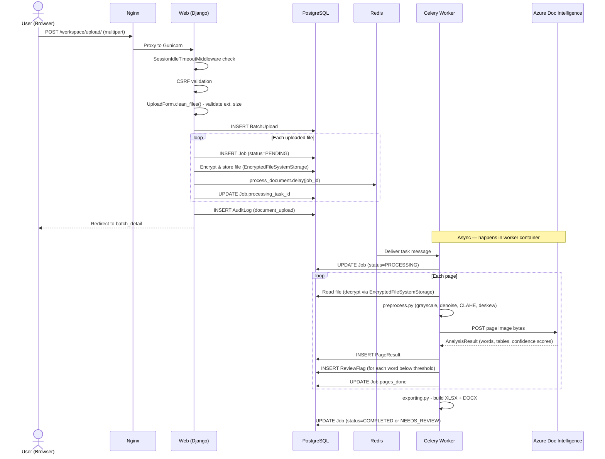

### 6.2 AJAX Status Polling

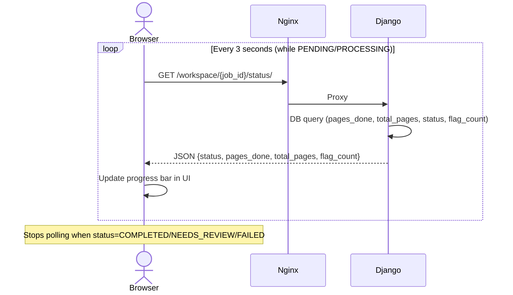

### 6.3 Review & Flag Approval Flow

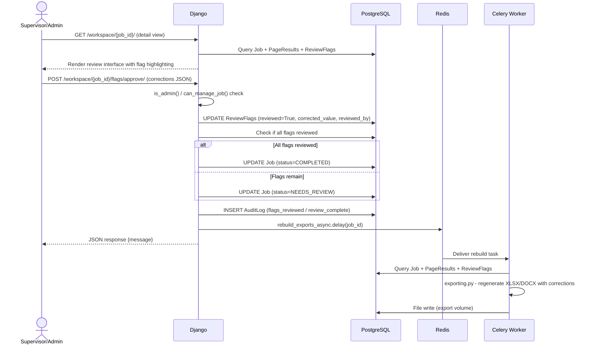

---

## 7. OCR Processing Pipeline

### 7.1 Pipeline Stages

```
                    ┌─────────────────────────────────────────────┐
                    │           process_document (Celery)          │
                    └─────────────────────────────────────────────┘
                                         │
                                         ▼
                    ┌─────────────────────────────────────────────┐
                    │  1. INGEST                                   │
                    │     - Read file bytes from encrypted storage │
                    │     - Detect file type (PDF vs image)        │
                    │     - PDF → per-page images via PyMuPDF      │
                    │       (DPI configurable, default 200)        │
                    └─────────────────────────────────────────────┘
                                         │
                                         ▼
                    ┌─────────────────────────────────────────────┐
                    │  2. PRE-PROCESS  (processing/preprocess.py) │
                    │     per page (numpy/OpenCV/PIL)             │
                    │                                             │
                    │  RGB → BGR (OpenCV format)                  │
                    │       ↓                                     │
                    │  Grayscale conversion                       │
                    │       ↓                                     │
                    │  Fast Non-Local Means denoising             │
                    │       ↓                                     │
                    │  CLAHE contrast enhancement                 │
                    │  (Contrast Limited Adaptive Histogram Eq)   │
                    │       ↓                                     │
                    │  Deskewing (contour-based angle detection)  │
                    │       ↓                                     │
                    │  Auto-crop to content bounding box          │
                    │       ↓                                     │
                    │  PNG bytes (ready for Azure)                │
                    └─────────────────────────────────────────────┘
                                         │
                                         ▼
                    ┌─────────────────────────────────────────────┐
                    │  3. OCR  (processing/azure_client.py)       │
                    │                                             │
                    │  Select Azure model per document_type       │
                    │  POST image bytes to Azure Doc Intelligence │
                    │  Parse AnalysisResult:                      │
                    │   - words[] with bounding polygons          │
                    │   - tables[][] with cell text               │
                    │   - avg_confidence score                    │
                    │   - low_confidence_words[] (< threshold)    │
                    │   - extracted_fields{} (prebuilt models)    │
                    │   - azure_latency_s                         │
                    └─────────────────────────────────────────────┘
                                         │
                                         ▼
                    ┌─────────────────────────────────────────────┐
                    │  4. FIELD EXTRACTION (processing/extractors)│
                    │                                             │
                    │  Registry pattern: @register(doc_type)      │
                    │  Regex-based extraction per document type:  │
                    │   - amounts, dates, names, IDs, totals      │
                    │  Merges prebuilt model extractions          │
                    └─────────────────────────────────────────────┘
                                         │
                                         ▼
                    ┌─────────────────────────────────────────────┐
                    │  5. PERSIST                                  │
                    │                                             │
                    │  INSERT PageResult (text, tables, fields,   │
                    │    avg_confidence, raw_response)            │
                    │  INSERT ReviewFlags (one per low-conf word) │
                    │  Save page_image PNG to ImageField          │
                    │  UPDATE Job.pages_done                      │
                    └─────────────────────────────────────────────┘
                                         │
                                         ▼
                    ┌─────────────────────────────────────────────┐
                    │  6. EXPORT  (processing/exporters.py)       │
                    │                                             │
                    │  build_excel():                             │
                    │   - pandas DataFrame per page/table         │
                    │   - Currency normalisation, name uppercase  │
                    │   - Confidence colour coding                │
                    │   - openpyxl formatting                     │
                    │                                             │
                    │  build_docx():                              │
                    │   - python-docx tables                      │
                    │   - Flag annotations inline                 │
                    │                                             │
                    │  Write to /data/exports/{job_id}/           │
                    └─────────────────────────────────────────────┘
                                         │
                                         ▼
                    ┌─────────────────────────────────────────────┐
                    │  7. FINALISE                                 │
                    │                                             │
                    │  flag_count > 0 → status = NEEDS_REVIEW     │
                    │  flag_count = 0 → status = COMPLETED         │
                    │  UPDATE Job.completed_at                    │
                    └─────────────────────────────────────────────┘
```

### 7.2 Confidence Threshold Hierarchy

```
SystemConfig.confidence_threshold  (global fallback, singleton)
      │
      │  overridden by
      ▼
Department.confidence_threshold    (per-department setting)
      │
      │  resolved by
      ▼
Job.effective_confidence_threshold (used during processing)
      │
      │  determines
      ▼
ReviewFlag created when word.confidence < threshold
```

---

## 8. Authentication & Authorization

### 8.1 Login Flow — SAML (Production)

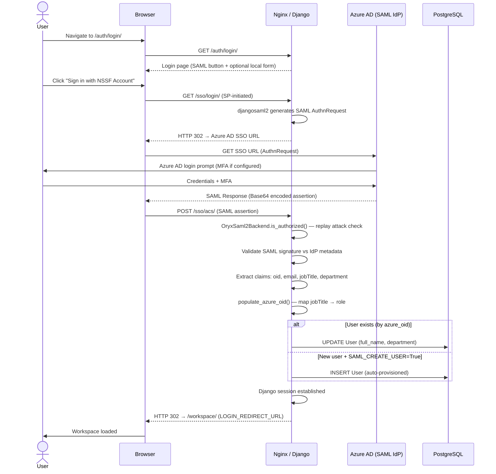

### 8.2 RBAC Permission Matrix

```
                        ┌──────────────────────────────────────────────────┐
                        │         ROLE-BASED ACCESS CONTROL MATRIX         │
                        ├─────────────────────┬────────┬──────────┬────────┤
                        │ Capability          │ Admin  │Supervisor│Operator│
                        ├─────────────────────┼────────┼──────────┼────────┤
                        │ Upload documents    │   ✓    │          │   ✓    │
                        │ View own jobs       │   ✓    │   ✓      │   ✓    │
                        │ View dept jobs      │   ✓    │   ✓      │        │
                        │ View all jobs       │   ✓    │          │        │
                        │ Review flags        │   ✓    │   ✓      │   ✓    │
                        │ Admin override flags│   ✓    │          │        │
                        │ Stop/restart jobs   │   ✓    │          │ owner  │
                        │ Export downloads    │   ✓    │   ✓      │   ✓    │
                        │ Dept settings       │   ✓    │   ✓      │        │
                        │ Global settings     │   ✓    │          │        │
                        │ Audit log view      │   ✓    │ dept     │        │
                        │ User stats dashboard│   ✓    │          │        │
                        │ Django admin        │superuser│         │        │
                        └─────────────────────┴────────┴──────────┴────────┘
```

### 8.3 Session Idle Timeout

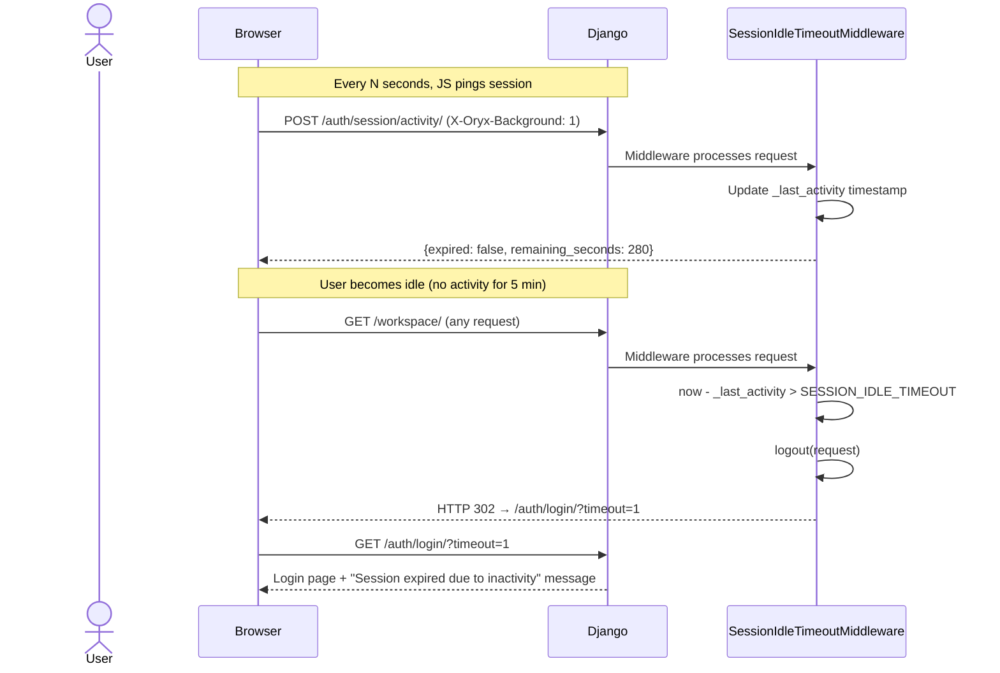

---

## 9. Async Task Architecture

### 9.1 Task Registration

```python
# config/celery.py
app = Celery("config")
app.autodiscover_tasks(["tasks"])
app.conf.include = ["tasks.ocr_task", "tasks.review_task", "tasks.export_task"]
```

### 9.2 Task Catalogue

| Task | Module | Retry | Trigger |
|---|---|---|---|
| `process_document` | `tasks.ocr_task` | 3× @ 30s (ConnectionError, TimeoutError) | Job upload |
| `approve_all_flags_async` | `tasks.review_task` | 2× @ 15s | Bulk review approval |
| `rebuild_exports_async` | `tasks.export_task` | default | Flag approval (single) |

### 9.3 Task Lifecycle & Stop Mechanism

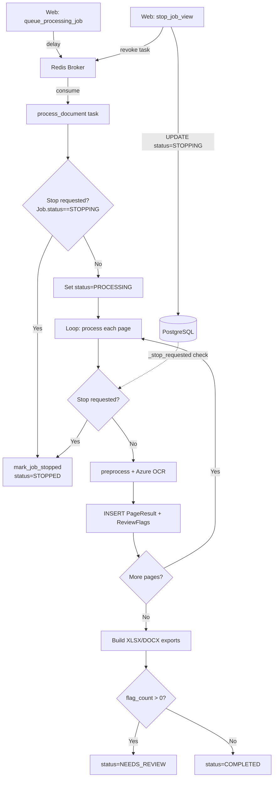

### 9.4 Celery Worker Configuration

```
celery -A config worker
  --concurrency 2          # 2 parallel OCR jobs
  --max-tasks-per-child 50 # Prevent memory leaks from OpenCV/PyMuPDF
  --loglevel info
```

The `max-tasks-per-child=50` guard is critical — OpenCV and PyMuPDF allocate native memory that can leak over long-lived processes.

---

## 10. Security Architecture

### 10.1 Defence-in-Depth Layers

```
┌─────────────────────────────────────────────────────────────────────┐
│  LAYER 1: NETWORK                                                   │
│  Nginx TLS (Sectigo wildcard *.nssfug.org)                         │
│  HTTPS-only, redirect HTTP → HTTPS                                  │
│  Static files served by Nginx (no Django involvement)              │
└─────────────────────────────────────────────────────────────────────┘
           │
┌─────────────────────────────────────────────────────────────────────┐
│  LAYER 2: IDENTITY & SESSION                                        │
│  SAML 2.0 / Azure AD (primary - production)                        │
│  Local login (optional - development only, ALLOW_LOCAL_LOGIN=False) │
│  Session idle timeout (5 minutes, configurable)                     │
│  SAML assertion replay detection (300s cache)                      │
│  Django CSRF protection (all POST/PUT/DELETE)                      │
└─────────────────────────────────────────────────────────────────────┘
           │
┌─────────────────────────────────────────────────────────────────────┐
│  LAYER 3: AUTHORISATION                                             │
│  RBAC (Admin / Supervisor / Operator)                              │
│  Department-scoped querysets (can't cross department boundary)      │
│  Database constraints enforce referential integrity of roles        │
│  All views decorated with @login_required                          │
│  REST_FRAMEWORK default = IsAuthenticated                           │
└─────────────────────────────────────────────────────────────────────┘
           │
┌─────────────────────────────────────────────────────────────────────┐
│  LAYER 4: DATA                                                      │
│  File encryption at rest: AES-256-GCM (EncryptedFileSystemStorage) │
│  Key stored in env var (FILE_ENCRYPTION_KEY)                       │
│  Encrypted format: 12-byte nonce | ciphertext | 16-byte GCM tag   │
│  UUID primary keys on Job, Batch, Page, Flag (no enumerable IDs)   │
│  PostgreSQL: password auth, internal Docker network only            │
└─────────────────────────────────────────────────────────────────────┘
           │
┌─────────────────────────────────────────────────────────────────────┐
│  LAYER 5: AUDIT                                                     │
│  Append-only AuditLog: user, action, job, department, IP, duration  │
│  Key events logged: upload, stop, restart, flags_reviewed,          │
│    review_complete, settings_updated, config_updated                │
│  Audit log visible only to Admin (all) / Supervisor (dept)         │
└─────────────────────────────────────────────────────────────────────┘
```

### 10.2 File Encryption Detail

```
Write path (upload):
  plaintext bytes
       ↓
  os.urandom(12) → nonce
       ↓
  AESGCM(key).encrypt(nonce, plaintext, aad=None)
       ↓
  nonce(12B) + ciphertext + tag(16B) → disk

Read path (download / processing):
  disk bytes
       ↓
  nonce = first 12 bytes
  ciphertext+tag = remainder
       ↓
  AESGCM(key).decrypt(nonce, ciphertext+tag, aad=None)
       ↓
  plaintext bytes
```

### 10.3 Threat Model — Addressed Risks

| Threat | Mitigation |
|---|---|
| Credential theft (local accounts) | SAML SSO preferred; local login disabled in prod |
| Session hijacking | Session idle timeout; HttpOnly / Secure cookies |
| SAML assertion replay | 300s assertion cache per (user, assertion_id) |
| Unauthorised document access | RBAC + department-scoped querysets |
| Enumeration of job IDs | UUID primary keys |
| File theft from storage | AES-256-GCM at rest |
| CSRF attacks | Django CsrfViewMiddleware |
| Clickjacking | XFrameOptionsMiddleware |
| Path traversal in downloads | Export path stored in DB, not user-supplied |
| Azure key exposure | Key in env var, not in code; DB field (not version controlled) |

---

## 11. Deployment Architecture

### 11.1 Production Topology

```
                        Internet
                           │
                    ┌──────▼──────┐
                    │   Nginx     │  Port 443 (TLS)
                    │   Reverse   │  Sectigo wildcard cert
                    │   Proxy     │  oryx.nssfug.org
                    └──────┬──────┘
                           │ HTTP/8343
              ┌────────────▼────────────┐
              │     Docker network      │  (internal bridge)
              │                         │
         ┌────▼────┐              ┌─────▼──────┐
         │   web   │              │   worker   │
         │ Django  │              │  Celery    │
         │ Gunicorn│              │  concur=2  │
         │ 3 workers│             └─────┬──────┘
         └────┬────┘                    │
              │                         │
         ┌────▼────────────────────────▼────┐
         │           PostgreSQL 16           │
         │         (pgdata volume)           │
         └───────────────────────────────────┘
              │                         │
         ┌────▼─────────────────────────▼───┐
         │              Redis 7              │
         │         (redisdata volume)        │
         │  db1=broker   db2=result backend  │
         └───────────────────────────────────┘
              │                         │
         ┌────▼──────┐           ┌──────▼──────┐
         │  /data/   │           │  /data/     │
         │  uploads/ │           │  exports/   │
         │ (AES-GCM) │           │ (XLSX/DOCX) │
         └───────────┘           └─────────────┘
```

### 11.2 Docker Compose Service Dependencies

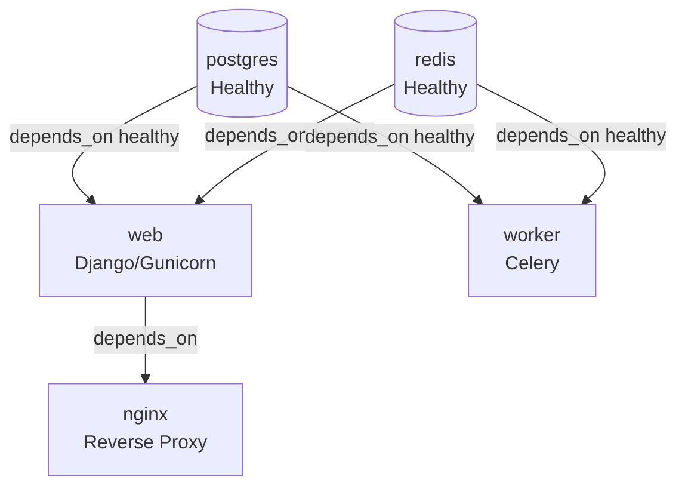

### 11.3 Start-up Sequence (web container)

```bash
python manage.py migrate          # Apply pending migrations
python manage.py collectstatic    # Gather static assets for Nginx
[ SEED_USERS=1 ] && python manage.py seed_users  # Dev only
gunicorn config.wsgi \
  --workers 3 \
  --timeout 300 \   # Long timeout for large document uploads
  --bind 0.0.0.0:8343
```

---

## 12. Key Design Decisions & Trade-offs

### 12.1 Monolith vs Microservices
**Decision:** Single Django monolith.  
**Rationale:** Team size, deployment simplicity, shared DB transactions for audit integrity. OCR processing isolated in `processing/` module with zero Django imports — ready to extract into a microservice later.  
**Trade-off:** Vertical scaling only for web tier; horizontal Celery workers compensate for compute.

### 12.2 Celery for Async Processing
**Decision:** Celery + Redis, not Django Channels or background threads.  
**Rationale:** Document processing takes 30s–5min. Long-running in a Gunicorn worker would exhaust the worker pool. Celery enables isolated, restartable, observable tasks.  
**Trade-off:** Redis single point of failure for task queue (mitigated by Redis persistence `appendonly yes`).

### 12.3 AES-256-GCM File Encryption
**Decision:** Encrypt uploads at rest using a custom `FileSystemStorage` subclass.  
**Rationale:** Compliance requirement — uploaded documents contain PII. Transparent to rest of app — `job.upload.read()` decrypts automatically.  
**Trade-off:** 28-byte overhead per file; CPU cost on read (negligible for document sizes). Key management is env-var based (no HSM / KMS).

### 12.4 UUID Primary Keys on Core Tables
**Decision:** Job, BatchUpload, PageResult, ReviewFlag use UUID PKs.  
**Rationale:** Prevents sequential enumeration of job IDs in URLs. Users cannot guess `?job_id=1234` to access others' documents.  
**Trade-off:** Slightly larger index size vs int; not meaningful at NSSF document volumes.

### 12.5 Processing Layer Isolation
**Decision:** `processing/` module has **zero Django imports**.  
**Rationale:** Can be unit-tested independently, run as a CLI tool, or extracted into a separate service without Django coupling.  
**Trade-off:** Requires explicit passing of configuration (endpoint, key, threshold) from Django layer.

### 12.6 Singleton SystemConfig
**Decision:** `SystemConfig` enforces `pk=1` in `save()`.  
**Rationale:** Global settings should have exactly one row; admin interface handles it as an edit-in-place form.  
**Trade-off:** Not appropriate if multi-tenancy is added later. Department-level overrides already break the singleton assumption for thresholds.

### 12.7 Template-driven UI (no SPA)
**Decision:** Server-rendered Django templates with AJAX only for status polling and session management.  
**Rationale:** Simplicity, no JS build pipeline, works without JS for most features.  
**Trade-off:** Page refreshes on form submissions; progress updates require polling.

---

## 13. Architectural Risks & Recommendations

### 13.1 Critical Risks

| # | Risk | Severity | Recommendation |
|---|---|---|---|
| R1 | **No Azure fallback** — If Azure Document Intelligence is unavailable, all processing fails with no degraded mode | High | Add a `tesseract` local OCR fallback mode behind a feature flag |
| R2 | **Encryption key in env var** — `FILE_ENCRYPTION_KEY` has no rotation mechanism; compromise exposes all uploads | High | Integrate with Azure Key Vault or AWS KMS for key management and add key rotation workflow |
| R3 | **No test suite** — `accounts/tests.py` and `documents/tests.py` are empty placeholders | High | Add integration tests covering: upload→process→review→export happy path, RBAC boundary tests, SAML auth |
| R4 | **Single Redis instance** — Task queue SPOF; Redis data loss = lost in-flight jobs | Medium | Add Redis Sentinel or cluster; implement job recovery scan on worker startup |
| R5 | **Gunicorn timeout 300s** — Large PDFs may hit timeout; Gunicorn kills worker mid-request | Medium | Move upload to chunked/multipart with immediate queue handoff; return 202 Accepted |
| R6 | **Export files unencrypted** — XLSX/DOCX in `/data/exports/` are plaintext while uploads are AES-encrypted | Medium | Apply same `EncryptedFileSystemStorage` to export volume, or encrypt at zip level for downloads |
| R7 | **`max_tasks_per_child=50`** — Memory guard on worker is a symptom; OpenCV / PyMuPDF leaks should be investigated | Low | Profile worker memory per task; add explicit cleanup (`gc.collect()`, `cv2.destroyAllWindows()`) |

### 13.2 Scalability Observations

- **Web tier:** Gunicorn with 3 workers handles moderate load. For high concurrency, increase workers or switch to async (Django ASGI + uvicorn).
- **Worker tier:** `concurrency=2` means 2 parallel OCR jobs. Azure Document Intelligence rate limits apply — consider a Celery rate limiter.
- **Database:** No read replica or connection pooler (PgBouncer) is configured. For high read volumes (audit log, dashboards), add a read replica.
- **File storage:** Local volumes prevent horizontal web/worker scaling. Migrate to Azure Blob Storage (already Azure-native) for shared storage across replicas.

### 13.3 Recommended Next Steps (Priority Order)

1. **Test suite** — any refactoring without tests is blind. Start with model constraints and RBAC boundary tests.
2. **Azure Blob Storage** — decouple uploads/exports from local volumes to enable horizontal scaling.
3. **Azure Key Vault** — move `FILE_ENCRYPTION_KEY` and `AZURE_KEY` into Key Vault with managed identity.
4. **Encrypt export files** — current gap in data-at-rest coverage.
5. **Graceful Azure fallback** — define SLA behaviour when Azure is unavailable.
6. **CI/CD pipeline** — no pipeline is visible in the repository; add GitHub Actions or Azure DevOps with lint, test, docker build stages.

---

*End of Architecture Document — Oryx Compliance OCR Data Extractor*  
*Prepared by automated analysis — validate against current codebase before distribution.*
